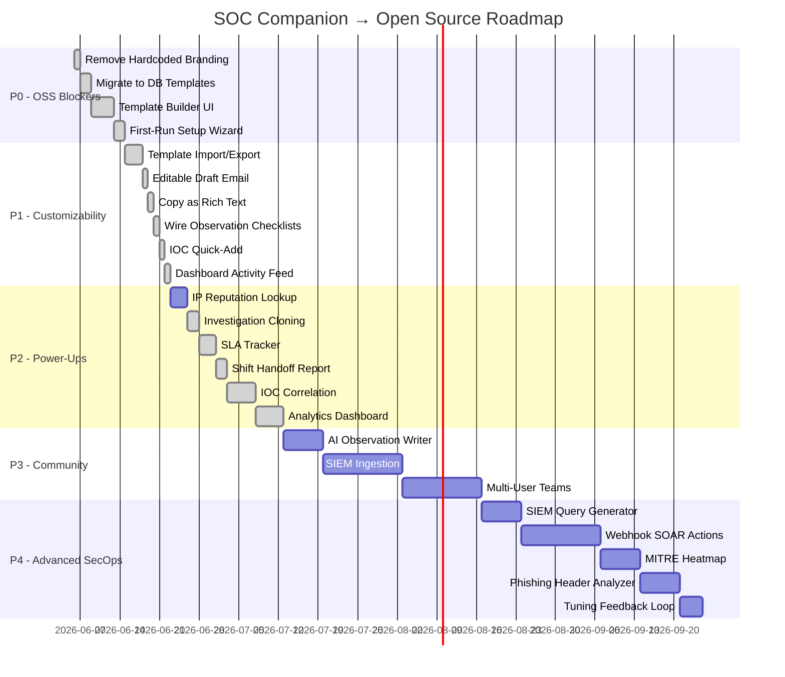

# SOC Companion — Open-Source Feature Roadmap

> **Goal**: Make SOC Companion a fully customizable, open-source tool that **any SOC analyst or company** can adopt — not just your ECI-SOC team.

---

## Current State Analysis

### What's Built ✅

| Module | Status | Open-Source Ready? |
|---|---|---|
| Clients (CRUD + color tags) | ✅ Complete | ✅ Yes |
| Alert Templates (DB-backed) | ✅ In `alert_templates` table | ✅ Yes (DB is now primary) |
| Hardcoded Alert Rules | ✅ Deprecated | ✅ Seed script uses `alertRulesDefaultSeed.ts` |
| Investigations | ✅ Full workflow | ✅ Uses dynamic branding via settings |
| IOCs | ✅ Sub-table per investigation | ✅ Yes |
| Rules Wiki | ✅ 89 seeded rules | ⚠️ Seed script is ECI-specific |
| Draft Email | ✅ Editable textarea | ✅ Dynamic branding |
| Dashboard | ✅ Stats + live activity | ✅ Yes |

### The Key Problems for Open Source

| # | Problem | Where |
|---|---|---|
| 1 | **Alert rules are hardcoded** in [alertRules.ts](file:///c:/Users/altha/Desktop/SOC-Companion/src/data/alertRules.ts) — 30 rules with full schemas, but users can't add/edit/delete without coding | `src/data/alertRules.ts` |
| 2 | **"ECI-SOC" is hardcoded** in every email template's sign-off | All `emailTemplate` strings in `alertRules.ts` |
| 3 | **DB `alert_templates` table exists** but isn't the primary source — the frontend uses the hardcoded TS file instead | `alert_templates` vs `alertRules.ts` |
| 4 | **141 rules in `drafts.mht`** but only ~30 are implemented in code | Gap of ~111 rules |
| 5 | **`seed_rules.sql`** seeds 89 rules for rules_wiki but with empty content | `seed_rules.sql` |
| 6 | **Analyst name hardcoded** as `{{analyst_name}}` but **team name hardcoded** as literal "ECI-SOC" | Every email template |

---

## Priority Matrix

| Priority | Criteria | Timeline |
|---|---|---|
| **P0 — Open-Source Blockers** | Must fix before any public release | This week |
| **P1 — Core Customizability** | Features that make it truly self-service | Next 2 weeks |
| **P2 — Workflow Power-Ups** | Features that make daily SOC work faster | Month 2 |
| **P3 — Community & Scale** | Features that build an ecosystem | Quarter 2+ |
| **P4 — Advanced SecOps** | Features for mature detection & response teams | Quarter 3+ |

---

## P0 — Open-Source Blockers (This Week)

### 1. 🔧 Remove All Hardcoded Branding → Settings-Driven

**The Problem**: Every email template ends with `"ECI-SOC"`. The `soc_email` default is `soc@eci.com`. Any new user sees someone else's brand.

**The Fix**:
- Add a **Settings / Profile** section (expand existing `SettingsPage.tsx`):
  - `team_name` → "ECI-SOC" → user configures "Acme SOC" or "Company-CSIRT"
  - `soc_email` → "soc@eci.com" → user configures their own
  - `analyst_display_name` → "Mohammed Althaf H" → pulled from user profile
  - `sign_off_template` → configurable: `"Regards,\n{{analyst_name}}\n{{team_name}}"`
- Store in a new `user_settings` table (or `user_profiles` with these columns)
- Replace all hardcoded `"ECI-SOC"` in email templates with `{{team_name}}`
- Replace hardcoded `soc@eci.com` with `{{soc_email}}`

**Effort**: ~1 day

---

### 2. 🔧 Migrate from Hardcoded `alertRules.ts` → DB-Only `alert_templates`

## Remaining P0 Work (All P0 Items Complete! 🎉)

### Feature 2 — Migrate `alertRules.ts` → DB (✅ Done)
- Written `scripts/seed-alert-templates.ts` to upsert all ~30 rules into `alert_templates`
- Updated `useAlertTemplates.ts` to remove hardcoded merge with ALERT_RULES
- Updated `InvestigationDetailPage.tsx` to use async hook instead of sync import
- Renamed `alertRules.ts` → `alertRulesDefaultSeed.ts`

### Feature 3 — Template Builder UI (✅ Done)
- `TemplateEditorPage.tsx` — tabbed editor (Basic Info / Fields / Observations / Email)
- `FieldSchemaBuilder.tsx` — drag-and-drop with `@dnd-kit/core`
- `ObservationBuilder.tsx` — observation template editor with `{{variable}}` highlighting
- `EmailTemplateEditor.tsx` — textarea with variable insertion toolbar + preview pane
- Routes `/templates/new` and `/templates/:id/edit` added to `App.tsx`

### Feature 4 — First-Run Setup Wizard (✅ Done)
- `SetupWizard.tsx` — 5-step full-screen modal with "Workspace Type" selector
- Triggered in `App.tsx` when `user_settings.setup_completed` is false
- Seed scripts run automatically from the browser

---

### 3. 🔧 Template Builder UI (Full CRUD for Alert Templates)

**Status:** ✅ Done

**The Problem**: The existing `AlertTemplatesPage.tsx` lets users browse templates and edit them via a basic modal, but there's no full-featured editor for the expanded schema.

**The Fix**: Build a full template editor:

- **Template List** (already exists) → add "Create New Template" button
- **Template Editor** page with tabs:
  - **Basic Info**: Name, Category, Description, Default Severity, MITRE Tactics
  - **Fields Schema Builder**: Drag-and-drop or add/remove field definitions
    - Each field: label, type (text/ip/select/email/url/textarea/number), placeholder, required flag, defang flag, options (for select)
  - **Observations Checklist Builder**: Add/remove observation templates with `{{variable}}` syntax, linked to field IDs
  - **Email Template Editor**: Markdown/text editor with variable insertion toolbar
    - Show available variables: `{{affected_user}}`, `{{source_ip}}`, etc.
    - Live preview panel showing rendered draft with sample data
- **Import/Export**: JSON export of a single template (for sharing)

**Effort**: ~4 days

> [!IMPORTANT]
> This is the **single most important feature** for open-source adoption. Without it, users can't customize the product to their SIEM rules without writing code.

---

### 4. 🔧 First-Run Setup Wizard

**Status:** ✅ Done

**The Problem**: A new user signs up and sees an empty app with no guidance.

**The Fix**: On first login (no clients, no templates), show a setup wizard:

1. **Welcome** → "SOC Companion is your investigation workspace. Let's set it up."
2. **Your Team** → Team name, SOC email, analyst name (populates `user_settings`)
3. **Import Templates** → Options:
   - "Start with the default SOC template library (89 rules)" → seeds from bundled defaults
   - "Import from JSON file" → upload a template pack
   - "Start blank — I'll create my own"
4. **Create First Client** → Name, short code, color tag
5. **Done** → Navigate to dashboard

**Effort**: ~2 days

---

## P1 — Core Customizability (Next 2 Weeks)

### 5. 📦 Template Import/Export & Sharing

**Why**: SOC teams at different companies handle different SIEM stacks. One team using Sentinel has different rules than one using Splunk. They need to share template packs.

**What**:
- **Export**: Any template → JSON file with full schema (fields, observations, email template)
- **Export All**: Bulk export all templates as a single JSON bundle
- **Import**: Upload JSON → preview templates → select which to import → creates in DB
- **Template Pack format** (`.soc-templates.json`):
```json
{
  "name": "Azure Sentinel Pack",
  "version": "1.0",
  "author": "Mohammed Althaf",
  "templates": [ ... ]
}
```
- Future: GitHub-hosted community template packs

**Effort**: ~3 days

---

### 6. ✍️ Editable Draft Email (Before Copy)

**Why**: The current draft tab shows a read-only `<pre>` block. Analysts always need to tweak wording.

**What**:
- Replace `<pre>` with a `<textarea>` (or rich text editor)
- Pre-populate with auto-generated draft
- Allow manual edits before copy/export
- "Regenerate" button to reset to auto-generated version
- Save the edited draft to `draft_email` column (already exists in schema but unused)

**Effort**: ~1 day

---

### 7. 📋 Copy Draft as Rich Text (HTML)

**Why**: SOC emails use **bold headers**, numbered lists. Copying plaintext into Outlook loses formatting.

**What**:
- "Copy as Rich Text" button alongside "Copy to Clipboard"
- Convert markdown-style draft → HTML → clipboard as `text/html`
- Pastes directly into Outlook/Gmail with `[ALERT SUMMARY]:` in bold, numbered observations, etc.

**Effort**: ~3 hours

---

### 8. 🔗 Wire Observation Checklists to Investigation Detail

**Why**: `observationsChecklist` exists in templates with `{{variable}}` placeholders, but the investigation detail page doesn't use them — analysts type observations from scratch.

**What**:
- When creating investigation with a template, pre-populate observations panel with checklist items
- Each item shows as a draft with blanks highlighted: _"Upon reviewing the logs, we could see sign-ins from **[affected_user]** towards **[application]**..."_
- Auto-fill variables from `field_data` as analyst fills in fields
- Analyst clicks "Accept" to finalize each observation

**Effort**: ~4 hours

---

### 9. 🧠 IOC Quick-Add from Investigation Fields

**Why**: Every investigation has IPs and domains in the fields. Adding IOCs separately in the IOC tab creates friction.

**What**:
- Detect IP/domain/hash patterns in field values (regex)
- Show a small `⊕ IOC` button next to matching fields
- One click → auto-fills IOC type + value + defangs → saves to `iocs` table

**Effort**: ~3 hours

---

### 10. 📊 Dashboard Activity Feed (Fill the Placeholder)

**Why**: The dashboard has a literal `"Activity feed coming soon..."` placeholder. First thing users see.

**What**:
- Pull latest 10 timeline events + recently updated investigations
- Each row: timestamp, client badge, case number, event description
- Click → navigates to investigation
- Auto-refresh every 60s

**Effort**: ~4 hours

---

## P2 — Workflow Power-Ups (Month 2)

### 11. 🧠 IP/Domain Reputation Lookup (Inline)

**Why**: In 24/25 of your real SOC emails, you manually look up IP reputation. This is the #1 time sink.

**What**:
- Integrate with free APIs: AbuseIPDB, ipinfo.io, or VirusTotal
- In investigation detail, show "🔍 Lookup" button next to IP fields
- Results: ISP, Country, Abuse score, VPN/Proxy detection
- Cache results in `enrichment_cache` table
- Auto-populate ISP/Geo into field_data

> [!TIP]
> Start with ipinfo.io free tier (50K lookups/month). Covers ISP, geo, VPN detection in one call.

**Effort**: ~3 days

---

### 12. 📋 Investigation Cloning / "Similar Case"

**Why**: Many investigations follow identical patterns (e.g., your 7+ AVD+DUO emails). You rewrite the same observations every time.

**What**:
- "Clone Investigation" button on any closed case
- Pre-fills: template, observation structure, field labels — clears specific values
- "Find Similar" on detail page: query same `alert_rule_id` + `client_id`, show past verdicts

**Effort**: ~2 days

---

### 13. 🔔 Pending Response Tracker & SLA Timer

**Why**: Several emails end with "could you please confirm..." — no way to track who you're waiting on.

**What**:
- When status = `pending_response`: prompt for "Who are you waiting on?" + "Expected by?"
- Dashboard widget: "Awaiting Response" with color-coded time badges
- Optional browser notification when SLA exceeds threshold

**Effort**: ~3 days

---

### 14. 📊 Shift Handoff Report

**Why**: SOC analysts hand off shifts. No way to generate "here's what happened on my shift."

**What**:
- New `/shift-report` page
- Select time range (default: last 8/12 hours)
- Auto-summary: cases opened, closed, pending, IOCs found
- Grouped by client → export as Markdown

**Effort**: ~2 days

---

### 15. 🗂️ Cross-Investigation IOC Correlation

**Why**: Same IPs/VPN services appear across investigations. No way to see "this IP was seen in 3 other cases."

**What**:
- Global IOC search page (`/iocs`)
- Search by value → see all investigations with this IOC
- Auto-flag: "⚠️ This IP was seen in Case X for Client Y"

**Effort**: ~5 days

---

### 16. 📈 Analytics Dashboard

**What**:
- Investigations over time (bar chart)
- Verdict distribution (TP/FP/Benign donut)
- MTTR per severity
- Top 10 triggered rules
- Per-client breakdown
- Filter by client + date range

**Effort**: ~1 week

---

## P3 — Community & Scale (Quarter 2+)

### 17. 🤖 AI-Assisted Observation Writer

- "✨ Draft Observations" button
- Sends field data + template context → LLM → returns numbered observations in SOC writing style
- Analyst reviews, edits, accepts

> [!IMPORTANT]
> Your 25+ emails show extremely consistent patterns — perfect for few-shot LLM prompting. Could cut 50%+ of investigation time.

**Effort**: ~1 week

---

### 18. 🔌 SIEM API Ingestion (Sentinel / Splunk / Elastic)

- Webhook or polling integration
- Auto-creates investigation with pre-filled alert data
- Maps SIEM fields → investigation `field_data`

**Effort**: ~2 weeks per SIEM

---

### 19. 👥 Multi-User / Team Support

- Organization entity above users
- Shared clients & investigations
- Assignment, activity log, shift-based views

**Effort**: ~2-3 weeks

---

### 20. 📎 File Attachments & Screenshots

- Supabase Storage integration
- Drag-and-drop upload, inline preview
- Include in export report

**Effort**: ~1 week

---

## P4 — Advanced SecOps (Quarter 3+)

### 21. 🛠️ SIEM Query Pivot Generator (KQL/SPL)

**Why**: Analysts constantly write the same queries to pivot on an IP, username, or hash.

**What**:
- Auto-generate pivot queries based on extracted `field_data` and IOCs.
- Support multiple SIEM dialects (KQL, Splunk SPL, Elastic EQL).
- 1-click copy for queries like "Find all sign-ins for [user] in last 7 days" or "Search [hash] across endpoints".

**Effort**: ~1 week

---

### 22. ⚡ Lightweight SOAR / Webhook Actions

**Why**: Moving from detection to response requires jumping into other consoles (Entra ID, CrowdStrike, Firewall).

**What**:
- Configure custom webhook buttons (e.g., "Reset User Password", "Block IP in Firewall", "Isolate Host").
- Include `field_data` payload in the webhook to trigger Azure Logic Apps, Tines, or direct API calls.

**Effort**: ~2 weeks

---

### 23. 🗺️ MITRE ATT&CK Heatmap & Tracking

**Why**: SOC managers need to know which tactics are hitting them most often to prioritize defenses.

**What**:
- Map Alert Templates to MITRE ATT&CK Tactics & Techniques.
- New Analytics view showing a MITRE Heatmap based on True Positive investigations.

**Effort**: ~1 week

---

### 24. 🎣 Phishing Header Analyzer

**Why**: Phishing is a huge portion of SOC alerts. Analyzing headers manually is tedious.

**What**:
- Dedicated "Phishing Tools" tab in investigations.
- Paste raw `.eml` headers to auto-extract and analyze SPF, DKIM, DMARC, hops, and spoofed domains.
- Automatically add extracted sender IPs, URLs, and Reply-To addresses to IOCs.

**Effort**: ~1 week

---

### 25. 📉 False Positive Tuning Feedback Loop

**Why**: SIEM engineers need data to tune noisy rules, and analysts hate closing the same FP 10 times a day.

**What**:
- When verdict = "False Positive", add an optional "Tuning Recommendation" field.
- "Rule Tuning Dashboard" for Detection Engineers summarizing the noisiest rules, time wasted, and analyst tuning suggestions.

**Effort**: ~4 days

---

## Build Order (Recommended)



---

## Top 5 Features by ROI (Impact ÷ Effort)

| Rank | Feature | Impact | Effort | Why It Matters for Open-Source |
|---|---|---|---|---|
| 🥇 | **Remove Hardcoded Branding** | 🔥🔥🔥🔥 | 1 day | No one will use a tool that says "ECI-SOC" everywhere |
| 🥈 | **Template Builder UI** | 🔥🔥🔥🔥🔥 | 4 days | Without this, users must edit TypeScript — kills adoption |
| 🥉 | **Migrate to DB Templates** | 🔥🔥🔥🔥 | 2 days | Prerequisite for Template Builder; removes code dependency |
| 4️⃣ | **Wire Observation Checklists** | 🔥🔥🔥 | 4 hours | Data already exists, just needs connection — instant value |
| 5️⃣ | **Copy as Rich Text** | 🔥🔥🔥 | 3 hours | Used every single investigation, tiny effort |

---

## Open-Source Readiness Checklist

Before public release, ensure:

- [x] **Zero hardcoded company names** — all branding via settings
- [x] **All templates in DB** — no TypeScript editing required for customization
- [x] **Setup wizard** — new users guided through configuration
- [x] **Import/Export** — teams can share template packs (`.soc-templates.json`)
- [x] **README.md** — setup instructions, screenshots, architecture
- [x] **LICENSE** — MIT / Apache 2.0 (your choice)
- [x] **.env.example** — documented environment variables
- [x] **Docker compose** — one-command local development

---

> [!NOTE]
> The **P0 items** (1-4) are the absolute minimum before open-sourcing. Without them, another team downloading your repo would see "ECI-SOC" everywhere and have to edit TypeScript to customize rules. With them, it becomes a genuinely self-service product.
>
> Want me to start building any of these? I'd recommend tackling P0 items in order: **Branding → DB Migration → Template Builder → Setup Wizard**.
